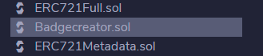

# Badge creator
Creador de insignias ERC721 en una red Ethereum para desplegar en la IDE Remix

## Instalación

Instalar la wallet metamask en el navegador: [Tutorial](https://etherworld.co/2019/07/07/install-metamask-on-brave-browser/).

Lo encontrarás en 
 [chrome web store](https://chrome.google.com/webstore/detail/metamask/nkbihfbeogaeaoehlefnkodbefgpgknn?hl=es).


Ir a la IDE de Remix y crear un workspace.

 [IDE Remix Ethereum](https://remix.ethereum.org/).

Crear los archivos en la carpeta contracts en la misma raiz.

 

Seleccionar el archivo Badgecreator.sol para compilar.



Ir a compilacion, el botón de la izquierda con la S de solidity, seleccionar una versión de compilación que no sea inferior a la de los contratos: ``` pragma solidity ^0.6.0;```.


Realizará las importaciones de Github automáticamente. 

Ir, debajo de compilación, a _deploy run transactions_. Botón con el símbolo de Ethereum.
Elija el entorno de desarrollo:
Si elije la maquina virtual en JavaScript podrá desplegar en local el contrato para realizar las pruebas de forma segura. 


Si elije _Injected Web3_ deberá conectar su metamask a una maquina virtual de Ethereum. en la imagen comprobará que hemos conectado a la red de pruebas _Robsten_. 


## Conseguir Ethereum para la redes de Pruebas.

Existen dos redes de pruebas en las que podemos desplegar los contratos. Pero, para poder emular a la red principal, necesitaremos de Ethers para poder pagar las transacciones y el gas. No se ilusione, solo funcionan en sus redes de prueba.

A continuación dispone de los links para solicitar Ethers para realizar sus pruebas tanto en _Robsten_ como en _Rinkeby_:

 [Robsten](https://faucet.ropsten.be/)

  [Rinkeby](https://faucet.rinkeby.io/)

## "Deployando" el contrato

El constructor recibe tres parámetros:

``` name```:
El nombre de nuestra plataforma de insignias, o serie de Insignias, que identificaran a los tokens.
Por ejemplo: "Tortillas-Descuento", "Zona Premium Insignias", "Jugadores con bigote de los ochenta".

``` symbol```: Las siglas de los token que los identificarán. Ejemplo: "TDS", "ZPI", "JBO".

``` setBaseURI``` Esta es una función que he parametrizado. En ella se ha de introducir __la URL principal__ donde esté alojado lo que se desee tokenizar. Por ejemplo: ```https://cainuriel.github.io/ ```
### Publish to IPFS


Antes de "Deployar" el contrato puede activar la publicación en IPFS. Disculpe mi falta de documentación al respecto, ya que no sé si lo realiza igualmente sin seleccionar. Si se publica
en la IPFS la "información tokenizada" quedará __para siempre relacionada con el token__.
Ello significa que si usted, por ejemplo, cambia la imagen del token en su servidor, __el token asociado no será afectado__. Sin embargo, si realiza otro token asociándolo a ésta información cambiada, __éste si tendrá la nueva imagen__. 

Para saber más:
[IPFS](https://ipfs.io//)

## JSON MODELO PARA LAS INSIGNIAS

El JSON que yo he utilizado para crear las insignias es el siguiente:
``` 
{
"name": "Nombre del Token",
"description": "Descripción del token",
"image": "https://direccion-de-la-imagen-del-token/imagen-del-token.png",
"attributes": [
{
"trait_type": "scarcity",
"value": "Rare"
},
{
"trait_type": "season",
"value": "2021"
},
{
"trait_type": "badge-type",
"value": "Award"
},
{
"trait_type": "serial_number",
"value": 1,
"max_value": 100,
"display_type": "number"
}
]
}

```
Los atributos son:

__Escasez__: 

Unique: una unidad. So Rare: diez unidades. Rare: cien unidades.

__sesión__:  

Utilizo el año para seriarizar los tokens.  

__Tipo_insginia__: 

Para realizar diferentes categorias. 

__número de serie__: 

Lo que determina en realidad su unicidad. 


## Las funciones del contrato

__approve__

Para delegar la gestión de un token. De ésta forma otras cuentas pueden utilizalo, por ejemplo para ponerse a la venta en una plataforma de venta de NFTs. Se introduce la dirección ethereum que tendrá la gestión del token, y la ID del mismo. Una delegación, solo gestiona no puede transferirlo.

__createBadge__

Función para crear las insignias. Devuelve una id consecutiva "1, 2, 3...". 
Se ha der introducir la dirección propietaria del token, y el __JSON del token__, por ejemplo "botonacar.json". Éste JSON será concatenado al ``` setBaseURI```. 
Probablemente habrá otra forma más eficiente de realizar ésta acción.

__safeTransferFrom__

Dos funciones para transferir el token de su propietario a otra cuenta. Una con el parametro ```_data``` y otra sin el. Si el token se ha delegado a otra cuenta para su gestión, se eliminará a la cuenta gestora en el momento de la transferencia. 

__setApprovalForAll__

Se puede delegar todos los tokens de un usuario a una cuenta. 

__transferfrom__ 

No hay que usar ésta función para transferir, porque no revisa de forma segura si la cuenta receptora cumple con los standares del ERC721. 

__balanceOf__ 

Número de tokens de un propietario

__baseURI__

Devuelve la URL principal en la que se concatenan los JSON. 

__getApproved__

Devuelve la cuenta delegada para gestionar un token.

__isApprovedForAll__

Indica si una cuenta está aprobada para gestionar los tokens de un propietario determinado.

__name__

Nombre de la plataforma de insignias.

__ownerOf__

Indica la cuenta propietaria de un Token. 

__supportInterface__

Implementación de la IERC165 interface.
Más info:
 [ERC165](https://docs.openzeppelin.com/contracts/3.x/api/introspection#IERC165)

__symbol__

Devuelve el símbolo del token

__TokenByIndex__

Devuelve la ID de un token por su índice en el map.

__tokenOfOwnerByIndex__

Obtiene el ID del token, con un índice dado, de la lista de tokens del propietario solicitado

__tokenURI__

Devuelve la URI completa del token. 

__totalSupply__

Devuelve el total de tokens creados.

## Saludos
A la comunidad Malandriner de  [Daniel Primo](https://www.danielprimo.io/).

## License
[MIT](https://choosealicense.com/licenses/mit/)
